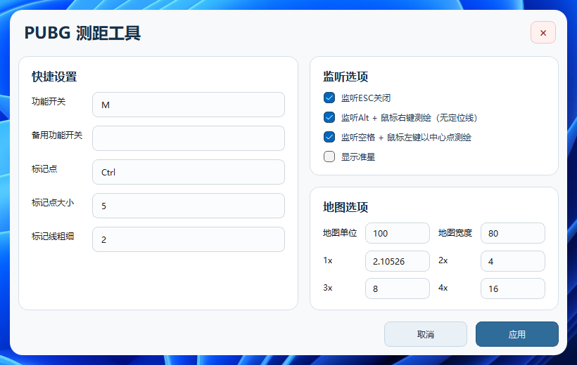

# pubg_rangefinder

`pubg_rangefinder` 面向 PUBG 的 Windows 桌面测距工具，可以通过自定义地图参数和倍率参数，适配不同地图比例、不同分辨率以及不同倍率下的测距需求，通常适用于正方形地图。

本项目仅基于屏幕绘图以及像素测量实现

## 目录

- [使用说明](#使用说明)
- [默认操作方式](#默认操作方式)
- [已实现功能](#已实现功能)
- [可调整参数](#可调整参数)
- [计算方法](#计算方法)
- [屏幕截图](#屏幕截图)

## 使用说明

1. 打开程序后，在设置窗口中填写地图宽度、地图单位和各倍率参数。
2. 根据自己的需求设置功能开关键和标记键。
3. 点击“应用”保存当前参数。
4. 按 `M` 开启测距功能。
5. 按住 `Ctrl` 后点击鼠标左键进行两点测距。
6. 按住 `Alt` 后点击鼠标右键进行无连线测距。
7. 按住 `Space` 后点击鼠标左键，可从屏幕中心点开始测距。
8. 使用鼠标滚轮切换不同倍率参数。

## 默认操作方式

- `M`：开启或关闭测距功能
- `Ctrl + 鼠标左键`：记录测距点，绘制连线并显示距离
- `Alt + 鼠标右键`：进行无连线测距
- `Space + 鼠标左键`：以屏幕中心点为起点进行测距
- `鼠标滚轮`：在不同倍率参数之间切换

## 已实现功能

- 透明悬浮测距层
- 设置窗口
- 准星显示
- 两点连线测距
- 无连线测距
- 以屏幕中心点为起点测距
- 鼠标滚轮切换不同倍率下的测距参数
- 自定义 1x、2x、3x、4x 倍率参数
- 自定义地图宽度、地图单位、标记点大小、标记线粗细
- 自定义功能开关键和标记键
- 功能关闭后自动清除当前测距内容

## 可调整参数

- 地图单位：默认 `100`
- 地图宽度：默认 `80`
- 1x 参数：默认 `2.10526`
- 2x 参数：默认 `4`
- 3x 参数：默认 `8`
- 4x 参数：默认 `16`
- 标记点大小：默认 `5`
- 标记线粗细：默认 `2`

其中，`1x`、`2x`、`3x`、`4x` 都可以手动修改，因此除了 PUBG 预设外，也可以根据你自己的游戏画面、准镜倍率或使用习惯做适配。

## 计算方法

程序内部先计算“每个地图单位对应多少屏幕像素”，再根据两点之间的像素距离换算成最终距离。

基础公式：

```text
单位宽度像素 = 屏幕高度 / 地图宽度
```

不同倍率下的单位宽度像素：

```text
0x / 基础视角 = 屏幕高度 / 地图宽度
1x = 屏幕高度 × 1x参数 / 地图宽度
2x = 屏幕高度 × 2x参数 / 地图宽度
3x = 屏幕高度 × 3x参数 / 地图宽度
4x = 屏幕高度 × 4x参数 / 地图宽度
```

最终距离计算公式：

```text
距离 = 两点像素距离 × 地图单位 / 当前倍率下的单位宽度像素
```

两点像素距离公式：

```text
两点像素距离 = sqrt((x2 - x1)^2 + (y2 - y1)^2)
```

## 屏幕截图


